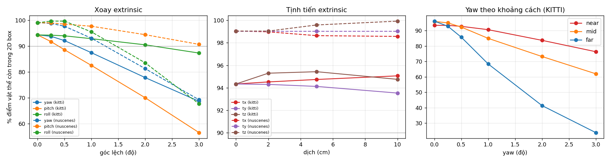
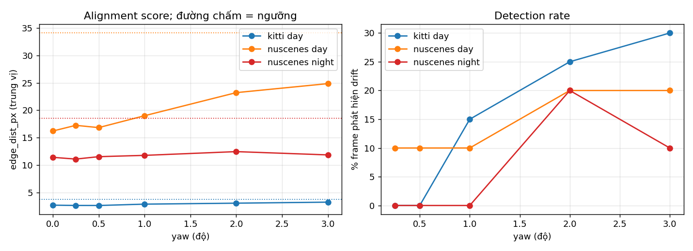
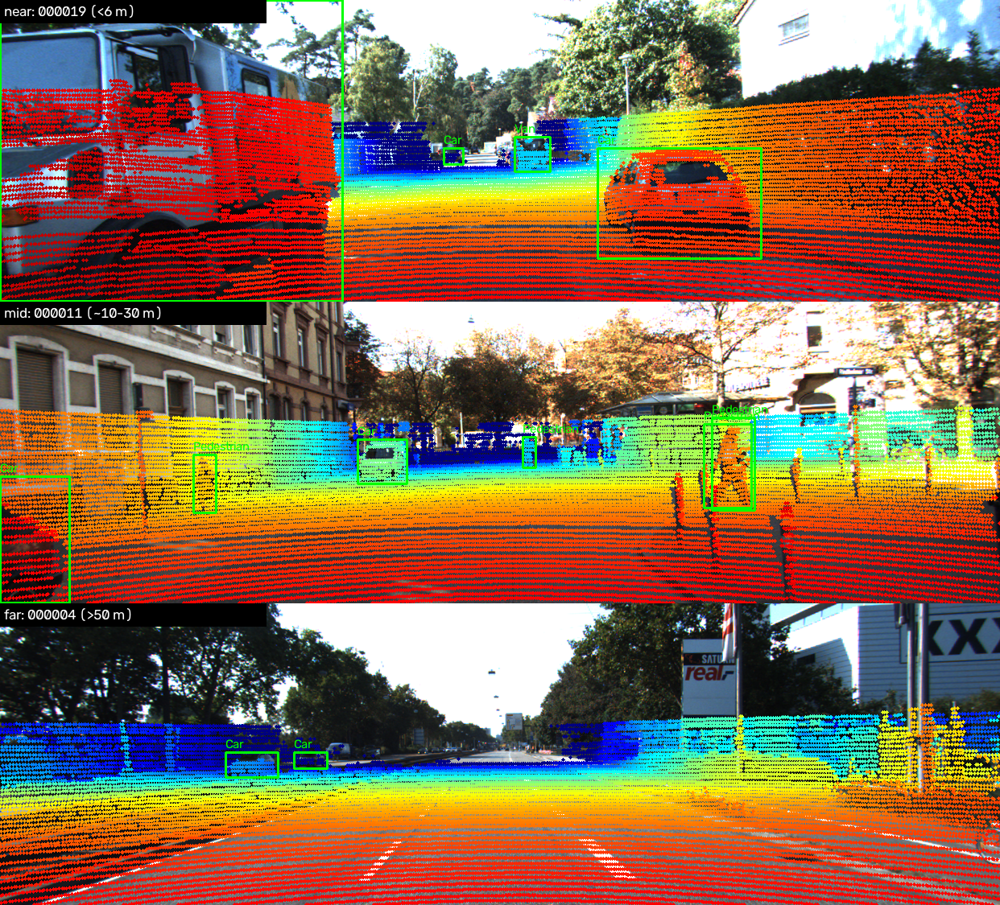
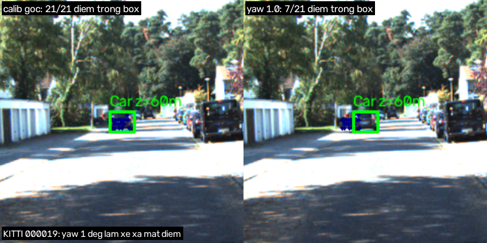
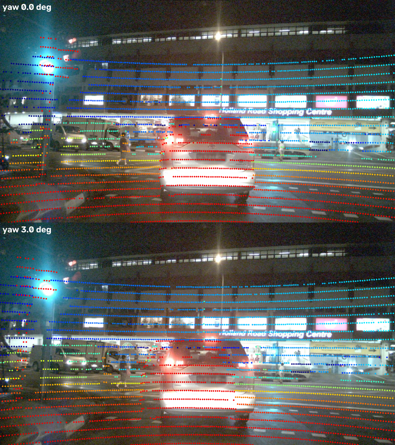

# Báo cáo Day 6: Độ nhạy của projection LiDAR-camera với calibration drift

- **Họ tên:** Hồ Đặng Phúc
- **MSSV:** 2A202602796
- **Lớp:** H209
- **Link repo:** https://github.com/hdphuc127/HoDangPhuc-2A202602796-Track4-Day21
- **Topic:** A — LiDAR-camera projection QA (mức Basic + Good + Advanced, kèm bonus B1–B6)
- **Dataset:** data/kitti_mini (20 frame), data/nuscenes_mini_subset (20 frame: mỗi 4 keyframe của scene-0103 ban ngày và scene-1094 ban đêm), data/synthetic (bonus B6)
- **Các frame đã dùng:** KITTI: toàn bộ 20 frame (demo: 000019 gần, 000011 trung bình, 000004 xa; failure: 000019). nuScenes: `scene-0103_000,004,…,036` và `scene-1094_000,004,…,036` (failure: scene-1094_000). Synthetic: 000000–000004.

## 1. Claim

**Lệch yaw 1° làm giảm từ ~96% xuống 68% số điểm LiDAR của xe ở xa (≥ 30 m) còn rơi vào 2D box của chính xe đó (KITTI, 20 frame), nhưng chỉ giảm 94% → 91% ở xe gần (< 15 m). Lệch tịnh tiến 10 cm hầu như không đổi metric này. Một alignment score không cần label (khoảng cách biên độ sâu LiDAR – biên Canny) chỉ phát hiện được 15% frame ở yaw 1° và 30% ở yaw 3° với ngưỡng 0 báo động giả.**

Hệ quả: hệ thống không tự phát hiện được bracket lệch 1° bằng score này, trong khi lỗi đã đủ làm hỏng gán nhãn/fusion cho vật ở xa.

## 2. Evidence

Metric (định nghĩa trong [src/calib_drift.py](../src/calib_drift.py)):
- `pct_in_box`: điểm nằm trong 3D box GT (tính bằng calib gốc), sau khi perturb còn chiếu vào trong 2D box GT của object đó. Chỉ object có ≥ 5 điểm và truncated ≤ 0.3. KITTI có 33 788 điểm object, nuScenes ngày 1 469, đêm 2 820.
- `pct_fov`: % điểm phía trước camera chiếu vào trong ảnh.
- `edge_dist_px`: trung vị khoảng cách (px) từ pixel biên độ sâu của LiDAR (nhảy sâu > max(1 m, 10%)) tới biên Canny gần nhất. Ngưỡng phát hiện = giá trị lớn nhất trên các frame sạch cùng dataset/nhóm (0 báo động giả trong mẫu). Không cần label.
- Xoay quanh trục của LiDAR (yaw quanh z, pitch quanh y, roll quanh x): 0, 0.25, 0.5, 1, 2, 3°. Tịnh tiến theo x/y/z: 0, 2, 5, 10 cm. Mỗi lần chỉ đổi một trục. Không có phần ngẫu nhiên, nên chạy lại ra đúng số (đã kiểm tra).

**Bảng chính: `pct_in_box` (%) theo yaw** — [results/calib_drift_summary.csv](../results/calib_drift_summary.csv)

| Yaw | KITTI tất cả | KITTI gần <15 m | KITTI trung 15–30 m | KITTI xa ≥30 m | nuScenes ngày | nuScenes đêm | Detect rate KITTI | Detect rate nuScenes ngày / đêm |
|---|---|---|---|---|---|---|---|---|
| 0° | 94.3 | 93.4 | 95.9 | 96.1 | 99.0 | 98.1 | – | – |
| 0.5° | 92.1 | 92.7 | 92.2 | 85.7 | 97.7 | 97.1 | 0% | 10% / 0% |
| 1° | 87.4 | 90.6 | 84.9 | **68.4** | 93.1 | 93.4 | 15% | 10% / 0% |
| 2° | 77.8 | 83.7 | 73.2 | 41.4 | 81.3 | 84.5 | 25% | 20% / 20% |
| 3° | 68.6 | 76.3 | 62.0 | 23.9 | 69.2 | 75.9 | 30% | 20% / 10% |

**Các trục khác (KITTI, tất cả khoảng cách):** pitch 1° → 82.5%, 3° → 56.6% (nhạy nhất). Roll 1° → 92.9%, 3° → 87.3%. Tịnh tiến x/y/z 10 cm → 95.1 / 93.5 / 94.7% (so với 94.3% ban đầu, tức không đáng kể). `pct_fov` hầu như không đổi: 32.1% → 32.2% ở yaw 3°.



Số liệu thô: [results/calib_drift_sweep.csv](../results/calib_drift_sweep.csv) (1000 dòng: dataset × frame × trục × mức). Biểu đồ alignment score: 

**Demo overlay (Basic, 3 khoảng cách):** 
Điểm khớp xe, người, cột, mặt đường, không có điểm trên bầu trời. Ảnh yaw 1°/3° để so sánh: [demo_yaw_1_vs_3deg.png](../results/figures/demo_yaw_1_vs_3deg.png). Test tay CP2: điểm `(10, 0, 0)` trên synthetic frame 000000 cho `z_cam = 9.727`, pixel `(613.96, 175.01)`. Khớp giá trị kỳ vọng 9.73 và (614, 175).

**Bonus**
- **B1 (so sánh 2 cấu hình/thuật toán, cùng dữ liệu, cùng metric):** hai metric phát hiện drift trên cùng sweep. `pct_in_box` cần label và nhạy (yaw 1° mất 3–28 điểm % tuỳ khoảng cách). `edge_dist_px` không cần label nhưng yếu (15% detect). `pct_fov` hoàn toàn mù (0.1 điểm %). Với score, tôi cũng thử median so với mean và hit-rate@2px, kernel lấp khoảng trống 5 so với 9 px (thử nhanh trên 12 frame, không đưa vào CSV). Kết quả đều đơn điệu nhưng tín hiệu nhiễu không kém: ở yaw 3° median tăng 2.73 → 3.28 px, mean 5.5 → 6.9 px.
- **B2 (≥2 loại suy giảm × ≥3 mức):** có 6 loại (3 góc, 3 trục dịch) × 4–5 mức, xem `drift_curves.png`.
- **B3 (latency p50/p95, bỏ 3 lần warm-up, 30 lần):** [results/latency.csv](../results/latency.csv). CPU Intel Core i5-12450HX, chỉ CPU, Windows 11.

  | Dataset | Bước | Số điểm | p50 (ms) | p95 (ms) |
  |---|---|---|---|---|
  | KITTI | project | 122 555 | 14.6 | 15.9 |
  | KITTI | project + edge score | 122 555 | 25.6 | 28.7 |
  | nuScenes | project | 34 688 | 4.6 | 5.0 |
  | nuScenes | project + edge score | 34 688 | 33.5 | 88.3 |
- **B4 (tool dùng lại được):** [src/calib_drift.py](../src/calib_drift.py) có `--help` và 5 lệnh con (`sweep`, `report`, `ego`, `latency`, `fail`). [src/synthetic_audit.py](../src/synthetic_audit.py) tự tìm lỗi dữ liệu.
- **B5 (cả 2 dataset thật, giải thích khác biệt):** cùng sweep trên KITTI và nuScenes (bảng trên). Khác biệt: (a) nuScenes baseline `pct_in_box` cao hơn (99% so với 94%) vì box 2D của nuScenes được dựng từ chính 3D box đã chiếu, còn box KITTI do người gán nên có sai số. (b) `edge_dist_px` baseline của nuScenes lớn hơn nhiều (16 px so với 2.7 px) vì LiDAR 32 beam rất thưa (khoảng cách beam 12–29 px ở ảnh 1600×900 so với ~5 px ở KITTI), nên phải lấp kernel 25 px và biên độ sâu bị nhoè khoảng 12 px. Vì thế score của nuScenes kém nhạy. (c) Ở nuScenes, pitch ít nhạy hơn KITTI (3°: 90.7% so với 56.6%). Tôi chưa kiểm chứng nguyên nhân (có thể do kích thước box theo chiều dọc, hoặc mẫu nhỏ). (d) Ban đêm score gần như mù (xem failure 2). Lưu ý mẫu nuScenes nhỏ (1 469 và 2 820 điểm, 20 frame), nên số liệu theo bin khoảng cách ở nuScenes (đặc biệt "far") có sai số thống kê lớn.
- **B6 (lỗi cài sẵn trong data/synthetic):** [results/synthetic_bugs.csv](../results/synthetic_bugs.csv), chạy `python -m src.synthetic_audit`.

  | Lỗi | Frame | Cách phát hiện |
  |---|---|---|
  | Điểm NaN/Inf (khoảng 23 điểm, 0.1%) | cả 5 frame (000000–000004) | `np.isfinite` theo từng điểm, `invalid_ratio` = 0.10% > 0 |
  | Mất dải azimuth (sector dropout, khoảng −40° đến −5°, tức phía trước-phải xe) | 000003 | Histogram azimuth bin 5°: dải ≥ 3 bin liên tục còn < 60% so với trung vị 4 frame còn lại. Số điểm cũng tụt 22 063 so với ~23 800 |
  | Timestamp nhảy cách 0.2 s (mất một frame) | 000003 (0.2 s → 0.4 s, các frame khác cách 0.1 s) | `np.diff(timestamps.txt)` lệch khỏi trung vị > 50% |

  Đã kiểm tra thêm và **loại trừ**: calib giống hệt nhau ở cả 5 frame, và 2D box khớp với 3D box chiếu (sai ≤ 2 px), nên không có lỗi calib/label cài sẵn.

**Lỗi Time vs lỗi Calibration (nuScenes, `results/ego_motion_ablation.csv`):** LiDAR và camera lệch trung bình 35.5 ms. Tắt bù ego-motion chỉ làm `pct_in_box` giảm 99.0 → 98.6% (ngày) và 98.1 → 97.5% (đêm), nhỏ hơn nhiều so với yaw 1° (−6 điểm %). Ở tốc độ xe thấp trong dữ liệu này (khoảng vài m/s), lỗi thời gian là bậc hai. Nó sẽ tăng tuyến tính theo vận tốc xe.

## 3. Failure case

**Failure 1: lệch yaw 1° làm xe ở xa mất hầu hết điểm (lớp Geometry).**

KITTI 000019, xe Car cách 60 m: calib gốc có 21/21 điểm trong box, yaw 1° còn **7/21**. Nguyên nhân: xoay θ làm điểm dịch ngang ≈ f·θ ≈ 721 px × 0.0175 = **~12.6 px ở mọi khoảng cách**, nhưng 2D box của xe cách 60 m chỉ rộng **24 px** (độ dịch bằng một nửa box là đã mất phần lớn điểm). Với xe gần 8 m (box rộng vài trăm px), 12.6 px không đáng kể. Do đó cùng một lỗi góc nhưng xe xa mất điểm nhanh gấp nhiều lần (xem biểu đồ bên phải: 96% → 68% so với 94% → 91%). Ngược lại, tịnh tiến t làm dịch f·t/Z px, tức 10 cm chỉ dịch ~7 px ở 10 m và ~1.2 px ở 60 m, nên nhỏ hơn kích thước box và metric không đổi, nhưng sai số này vẫn gây lệch nhiều ở sát xe (liên quan đến câu hỏi tz và `edge_dist` của nuScenes tăng 16 → 30 px khi tz = 10 cm). Cách phát hiện khi chạy thật: (i) không dùng `pct_fov`, vì nó mù trước drift (xem số liệu), (ii) theo dõi tỉ lệ điểm trong box của các track xe xa có label từ camera detector (2D) và phát cảnh báo khi xu hướng tụt, (iii) tái calib tự động (ví dụ tối ưu alignment score theo thời gian).

**Failure 2: alignment score bị mù trong ảnh ban đêm (lớp Metric/Preprocess).**

nuScenes scene-1094_000 (ban đêm sau mưa): yaw 3° làm toàn bộ điểm dịch ngang ≈ f·θ ≈ 1266 × 0.052 ≈ **66 px** (nhìn thấy rõ ở các vạch ngang trên xe và toà nhà), nhưng `edge_dist_px` hầu như không đổi (baseline đêm 11.4 px so với 11.9 px ở yaw 3°, detect rate chỉ 10%). Nguyên nhân: (1) ảnh tối, biên Canny thưa và chủ yếu ở nguồn sáng/đèn xe, (2) LiDAR 32 beam thưa nên "biên độ sâu" bị nhoè khoảng 12 px, (3) cảnh có nhiều cạnh ngang lặp lại (khung cửa, vạch beam) nên điểm dịch ngang vẫn rơi vào biên khác. Trung vị khoảng cách tới biên gần nhất bão hoà ngay cả khi lệch. Cách khắc phục: dùng metric dựa trên nhiều khung thời gian (tích luỹ), hoặc dùng intensity LiDAR và mutual information thay cho biên độ sâu, hoặc đặt ngưỡng riêng cho ngày/đêm (ngưỡng ban ngày KITTI 3.8 px không dùng được ở nuScenes 34 px).

**Điều kiện làm claim sai:** (a) nếu cảnh không có cấu trúc biên độ sâu rõ (đường trống, tường phẳng) thì score không có tín hiệu để phát hiện; (b) nếu dùng sensor 32 beam, các số theo bin khoảng cách của nuScenes có sai số lớn do mẫu nhỏ; (c) thứ tự xoay của `perturb_extrinsic` là xoay quanh trục của LiDAR rồi ghép vào Tr_velo_to_cam, nên với bracket thật xoay quanh trục camera thì số có thể khác chút.

## 4. Khuyến nghị nếu triển khai thật

**Use-case:** ADAS/xe tự hành cần fusion LiDAR-camera (gán nhãn tự động, track vật cản ở xa, phát hiện người đi bộ). Trả lời câu hỏi thuyết trình: **nếu bracket lệch 1° sau va chạm nhẹ, hệ thống không tự phát hiện được bằng edge-alignment score một frame** (chỉ 15%/10% frame bị phát hiện), và lỗi gây hại nhất ở **vật ≥ 30 m** (mất ~28 điểm %), không phải ở vật gần.

Đánh đổi và đề xuất:
- Đừng dựa vào `pct_fov` hay một score ảnh đơn lẻ. Ghi log (1) `pct_in_box` của các object có label tin cậy chia theo khoảng cách (<15, 15–30, ≥30 m), (2) alignment score theo cửa sổ trượt (ví dụ 5–10 s) thay vì 1 frame, và báo cáo cả ngày/đêm riêng, (3) độ lệch thời gian LiDAR–camera (`dt_ms`) và vận tốc xe, vì lỗi Time tăng theo tốc độ, (4) cảm biến gia tốc/IMU trên bracket để biết khi có va chạm, vì đây là tín hiệu rẻ nhất để kích hoạt tái calib.
- Tốc độ: projection chiếu 122k điểm mất ~15 ms (CPU) và thêm ~11 ms cho score trên KITTI, khoảng 26 ms/frame, đủ cho chạy nền 10 Hz nhưng không nên nằm trên đường chạy chính. Trên GPU hoặc downsample điểm thì rẻ hơn nhiều. Sau khi lọc theo vùng ảnh chỉ cần ~25–30% điểm (xem `pct_fov`).
- An toàn: ngưỡng của tôi lấy trên 20 frame sạch, nên khi triển khai phải hiệu chỉnh lại ngưỡng theo từng sensor/xe và cần ≥ hàng nghìn frame; chưa thể coi 0% báo động giả là chắc chắn.
- Bước tiếp: tích luỹ nhiều frame, dùng intensity thay biên độ sâu, và thêm kiểm tra theo vật xa. Có thể tối ưu extrinsic online bằng score thay vì chỉ cảnh báo.

## 5. Cách chạy lại

```bash
pip install -r requirements.txt
python tools/verify_data.py --data-root data/kitti_mini
python tools/verify_data.py --data-root data/nuscenes_mini_subset

# CP2: demo overlay (3 khoảng cách) và test calib synthetic
python -m starter.projection --data-root data/synthetic --frame 000000
python -m starter.projection --data-root data/kitti_mini --frame 000019
python -m starter.projection --data-root data/kitti_mini --frame 000011
python -m starter.projection --data-root data/kitti_mini --frame 000004
python -m starter.projection --data-root data/kitti_mini --frame 000011 --yaw-deg 1.0
python -m starter.projection --data-root data/nuscenes_mini_subset --frame scene-0103_010

# CP3: thí nghiệm chính (~1.5 phút), bảng tóm tắt, biểu đồ và 2 ảnh fail_*
python -m src.calib_drift sweep      # results/calib_drift_sweep.csv
python -m src.calib_drift report     # results/calib_drift_summary.csv + figures/*.png
python -m src.calib_drift ego        # results/ego_motion_ablation.csv
python -m src.calib_drift latency    # results/latency.csv (số ms phụ thuộc máy)
python -m src.synthetic_audit        # results/synthetic_bugs.csv

python tools/check_submission.py
```

Ghi chú: `demo_overlay_3_distances.png` và `demo_yaw_1_vs_3deg.png` là ảnh ghép thủ công từ các ảnh `overlay_*` do lệnh `starter.projection` ở trên tạo ra (ghép bằng vài dòng OpenCV, không có script riêng).

## 6. Khai báo sử dụng AI

| Công cụ | Dùng cho việc gì | Bạn đã kiểm chứng thế nào |
|---|---|---|
| Claude Code (Claude Sonnet 5.5) | Cài 2 hàm `velo_to_cam` / `cam_to_image`, viết `src/calib_drift.py`, `src/synthetic_audit.py`, chạy thí nghiệm và soạn REPORT này | Test tay `(10, 0, 0)` → z = 9.73, pixel (614, 175) khớp CP2. Xem ảnh overlay thấy điểm khớp xe/người/cột. Chạy lại `sweep` cho cùng kết quả (không có tính ngẫu nhiên). Các số trong báo cáo được copy từ CSV do code tạo ra. Kiểm tra lỗi synthetic bằng cách đối chiếu trực tiếp calib, label, timestamp.  |
